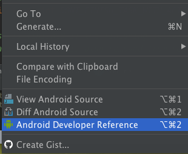
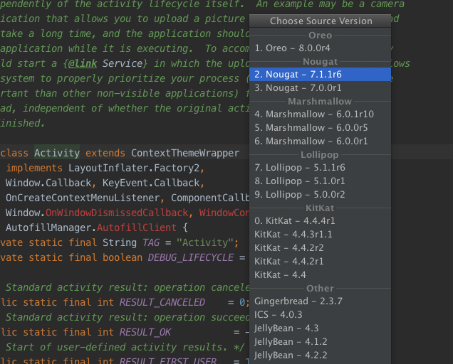
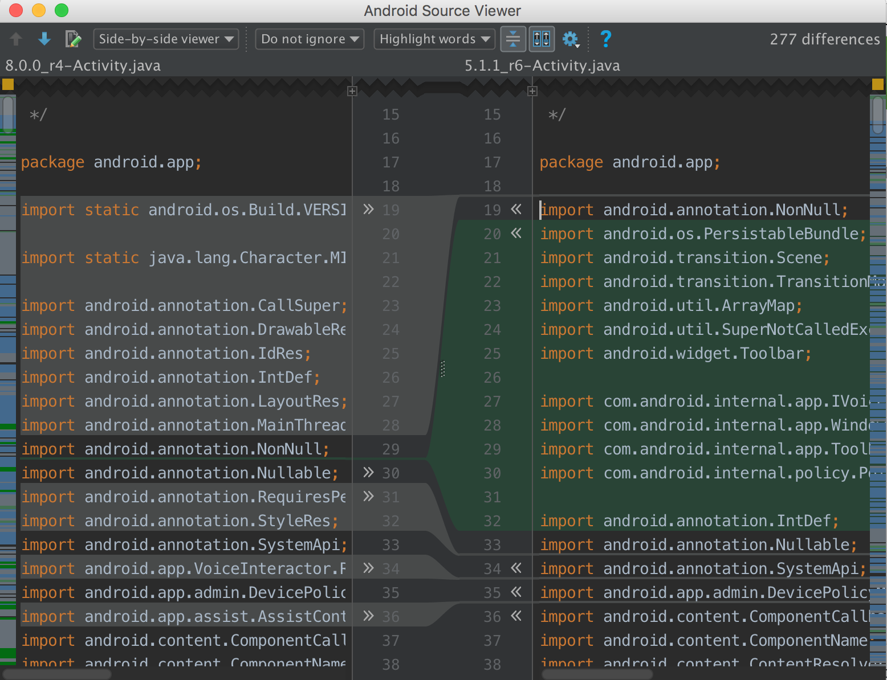
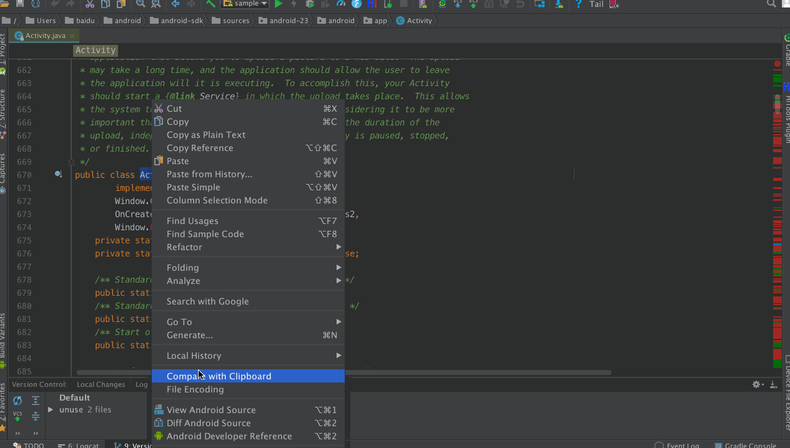
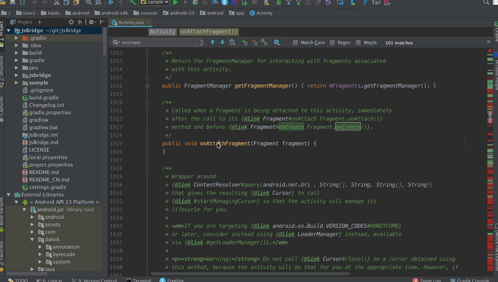

# AndroidSourceViewer
Android Studio 在线查看 Android 和 Java 指定版本源码插件

## Features
* 支持查看 Android / Java 任意版本源码
* 支持对比 Android / Java 任意两个版本源码差异
* 支持 Android 官网文档查看和方法定位

## Screenshot
 
 
 
 
 

## Download
* Android Studio 插件中心搜索 `AndroidSourceViewer`&nbsp;&nbsp;
* 下载[AndroidSourceViewer.jar](./jar)  
* 目前插件还在 Jetbrains 审核阶段, 建议下载Jar本地安装

## Improve
* 不支持查找变量对象是内部类
* 本地源码不支持方法的定位
* 还有很多其他尚未发现的缺陷和不足，欢迎提交 issue 和 PR

## Thanks
* Android 源码来自 [http://androidxref.com](http://androidxref.com)
* Java 源码来自 [http://grepcode.com/](http://grepcode.com/)

## License
<pre>
Licensed under the Apache License, Version 2.0 (the "License");
you may not use this file except in compliance with the License.
You may obtain a copy of the License at

   http://www.apache.org/licenses/LICENSE-2.0

Unless required by applicable law or agreed to in writing, software
distributed under the License is distributed on an "AS IS" BASIS,
WITHOUT WARRANTIES OR CONDITIONS OF ANY KIND, either express or implied.
See the License for the specific language governing permissions and
limitations under the License.
</pre>
